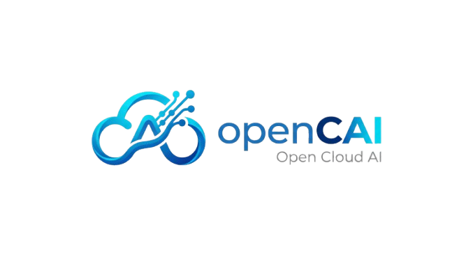

<p align="center">
  
</p>

# OpenCAI

**Manage your cloud by chatting with an AI agent.** OpenCAI is an open, self-hosted AIOps and
FinOps platform: ask in plain language, see the exact command, approve it, and it runs.

## Why OpenCAI

- **Just ask.** "How many EC2 instances are running?" or "Show my costs by service." No console
  hunting, no CLI syntax to remember.
- **You stay in control.** Anything that changes your cloud waits for your approval. Read-only
  questions are answered straight away.
- **Safe by design.** Every command is checked by a strict policy and runs in an isolated Docker
  sandbox, never on your server.
- **Secure.** MFA sign-in, encrypted cloud credentials, and a full audit trail of every action.
- **Your model, your brand.** Works with Anthropic, OpenAI, Gemini, Groq and NVIDIA. Add your own
  name and logo.
- **Yours to host.** Source-available, runs on your own machine or server. Works with AWS today.

## Quick start

You need [Git](https://git-scm.com/) and [Docker](https://www.docker.com/products/docker-desktop/).
On Windows, run these in Git Bash.

```sh
git clone https://github.com/AB527/opencai.git
cd opencai
cp backend/.env.example backend/.env
cp frontend/.env.example frontend/.env
```

Set three values:

- in `backend/.env`, `JWT_SECRET` (use `openssl rand -base64 48`) and `MASTER_ENCRYPTION_KEY`
  (use `openssl rand -base64 32`)
- in `frontend/.env`, `VITE_API_BASE_URL=http://localhost:4000`

Start it:

```sh
docker build -t opencai-sandbox:2.15.30 backend/sandbox
docker compose up --build -d
docker compose exec backend npm run prisma:seed
```

Open http://localhost:8080 and sign in as `admin` / `admin`. You will be asked to set up MFA;
change the password after that.

## Learn more

- [Setup guide](docs/SETUP.md): Windows, macOS and Linux, plus running it for development
- [How it works](docs/workflows/README.md): diagrams of the main flows
- [Architecture and guardrails](PLAN.md)
- [Contributing](CONTRIBUTING.md)
- [Releases](docs/RELEASES.md)

## License

OpenCAI is licensed under the [Functional Source License 1.1, ALv2 Future License](LICENSE.md)
(FSL-1.1-ALv2). You can use, modify and redistribute it for any purpose except offering it to
others as a competing commercial product or service. Each release becomes available under
Apache 2.0 two years after it is published.

The OpenCAI name and logo are not covered by this license and may not be used for derived
products.
