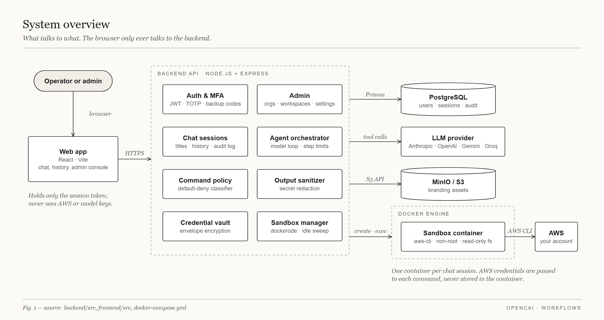
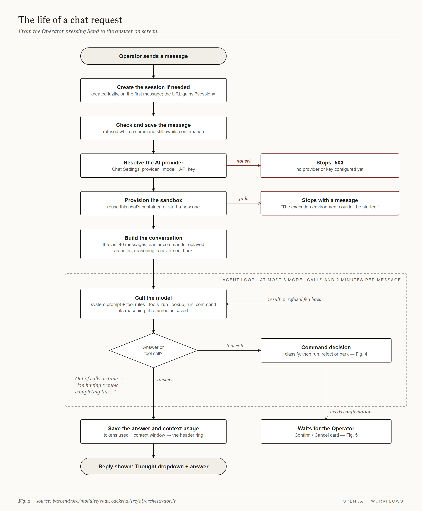
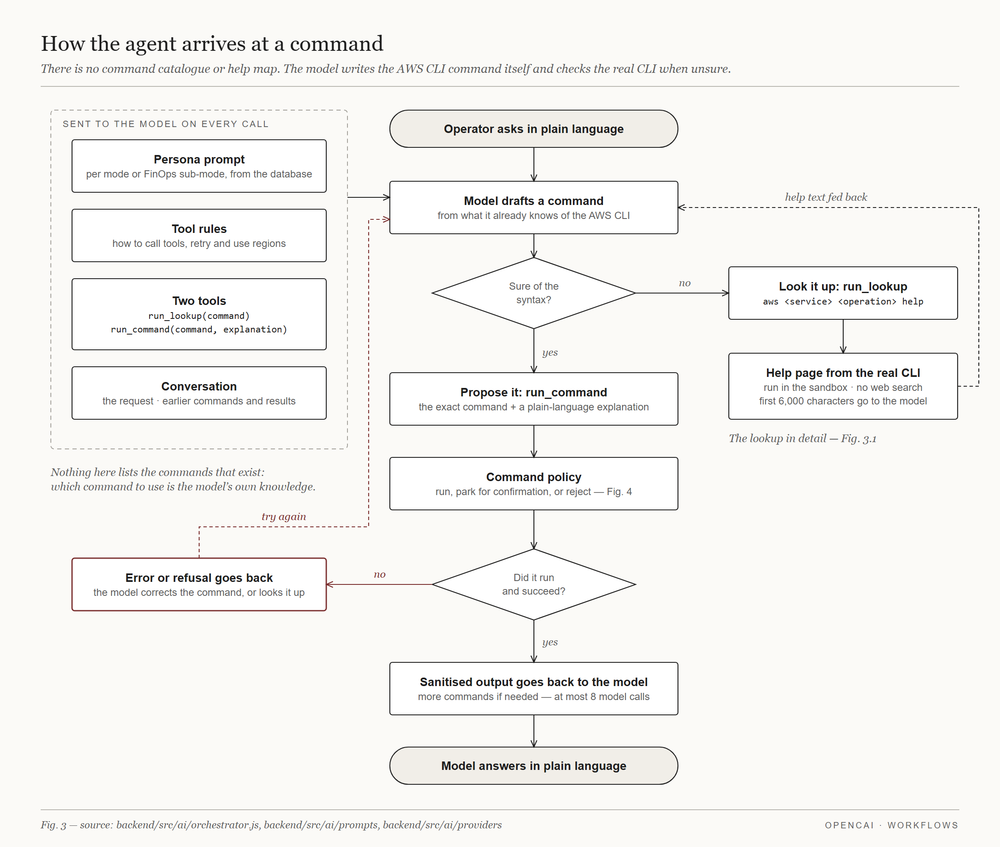
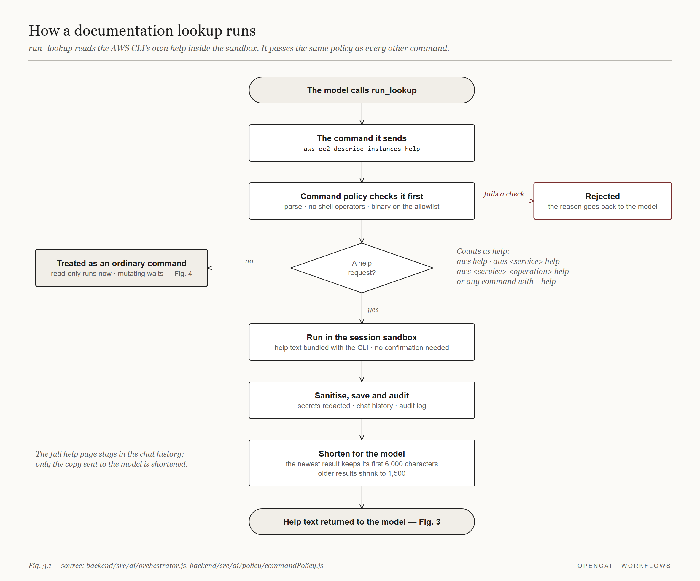
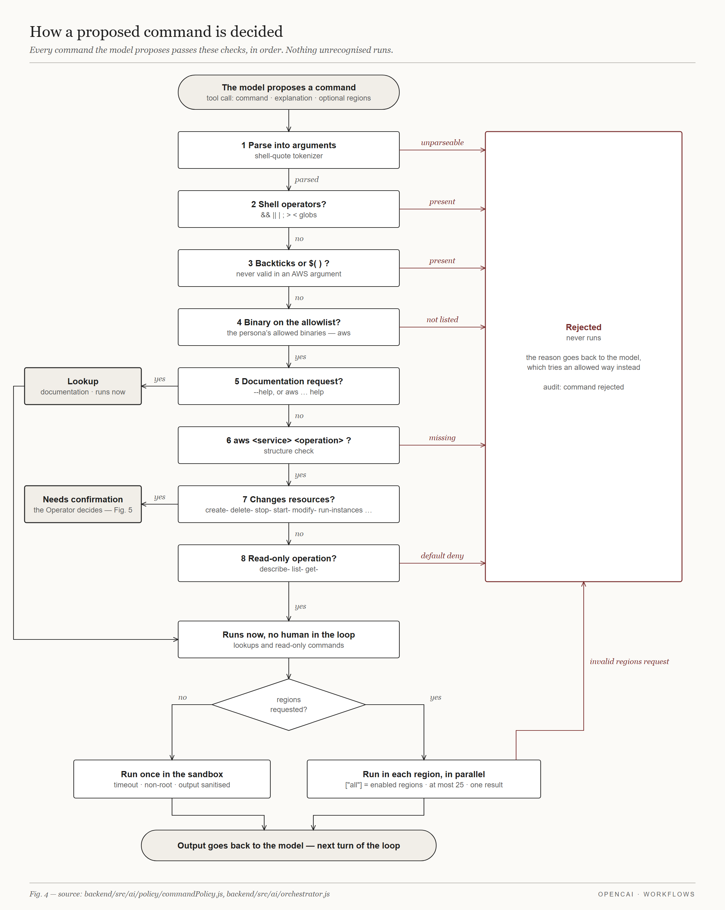
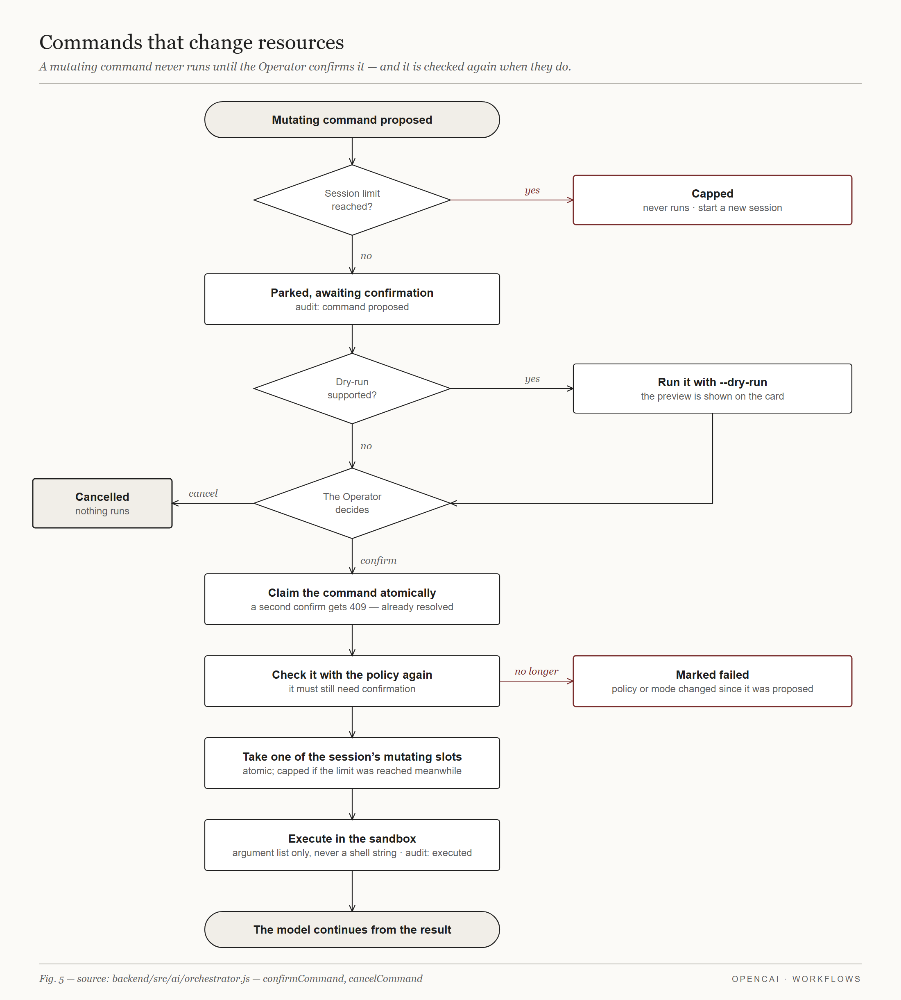
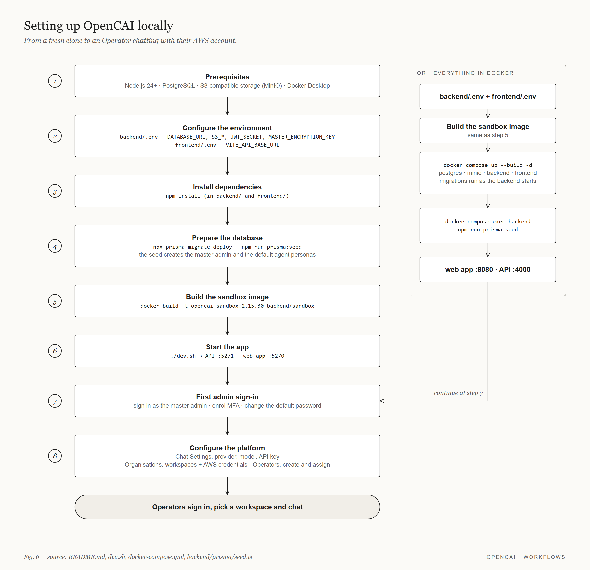
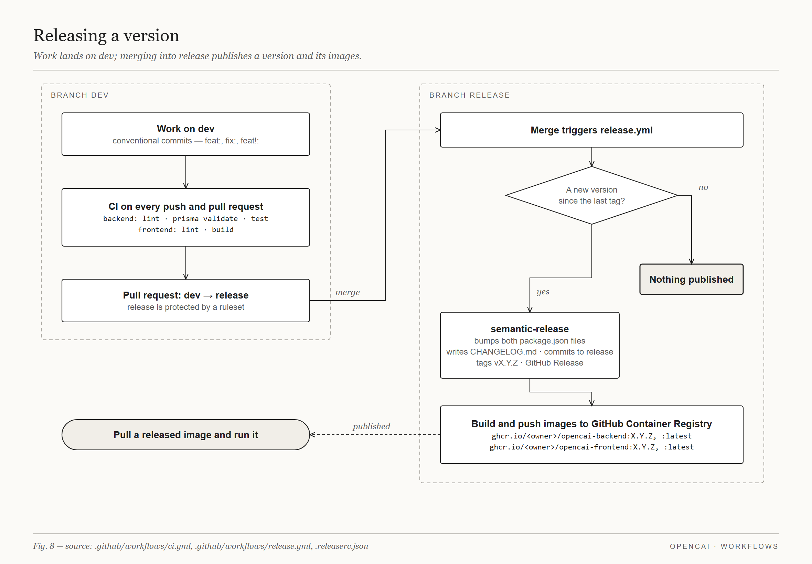

# Workflows

Diagrams of how OpenCAI works, drawn from the code they describe. Each figure
names its source files in its footer.

| Figure | What it shows |
|---|---|
| [1. System overview](01-system-overview.png) | The parts of the system and what talks to what |
| [2. The life of a chat request](02-chat-request.png) | From pressing Send to the answer on screen, including the agent loop and its limits |
| [3. How the agent arrives at a command](03-command-creation.png) | What the model is given, how it drafts a command, and the lookup and retry loop |
| [3.1. How a documentation lookup runs](03-1-command-lookup.png) | What happens when the model checks the AWS CLI help with `run_lookup` |
| [4. How a proposed command is decided](04-command-decision.png) | The command policy's checks, in order, and where each command ends up |
| [5. Commands that change resources](05-confirmation.png) | The confirmation flow for mutating commands |
| [6. Setting up OpenCAI locally](06-local-setup.png) | From a fresh clone to an Operator chatting, with or without Docker for everything |
| [7. Signing in](07-sign-in-and-mfa.png) | Password, MFA enrolment and verification, backup codes |
| [8. Releasing a version](08-release.png) | CI, the `dev` → `release` flow, semantic-release and image publishing |


















## Updating the diagrams

The figures are generated by [`src/build.mjs`](src/build.mjs), which lays each
one out with explicit coordinates. After editing it, rebuild from the repo
root:

```sh
node docs/workflows/src/build.mjs
```

The script draws each figure as SVG, renders it to a 2× PNG with headless
Chrome, and removes the SVG, so only the PNGs are kept. If Chrome is not in a
standard location, set `CHROME` to the browser binary; without one the SVGs are
left in place and no PNGs are written.

When the code a figure describes changes, update the figure in the same change.
