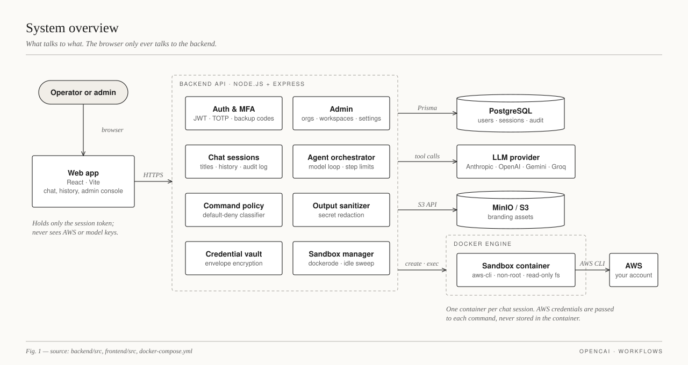
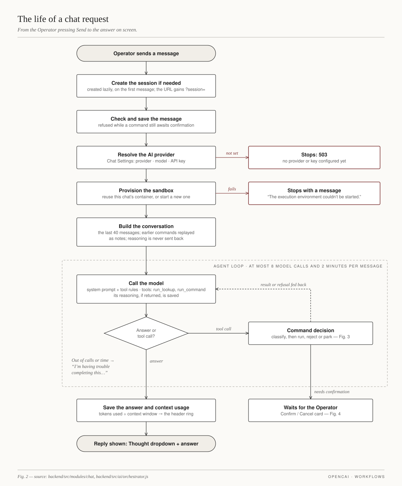
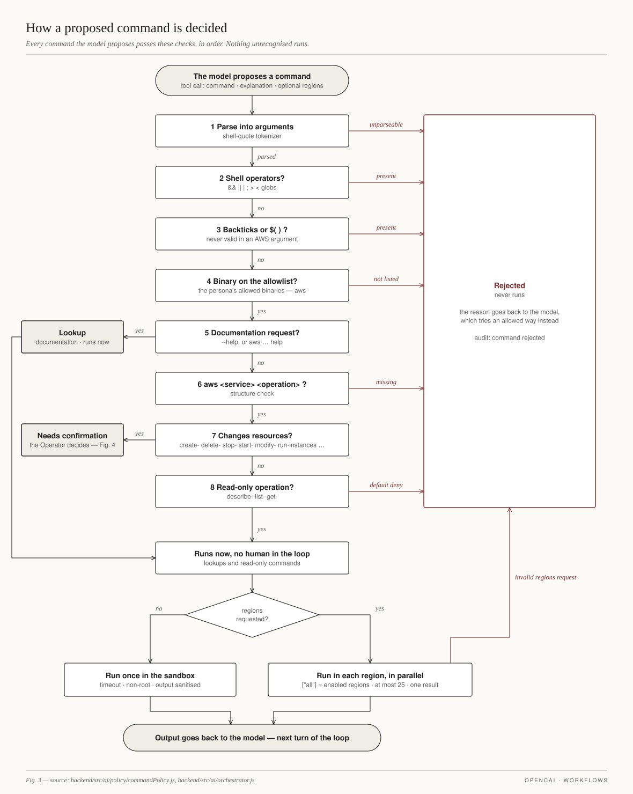
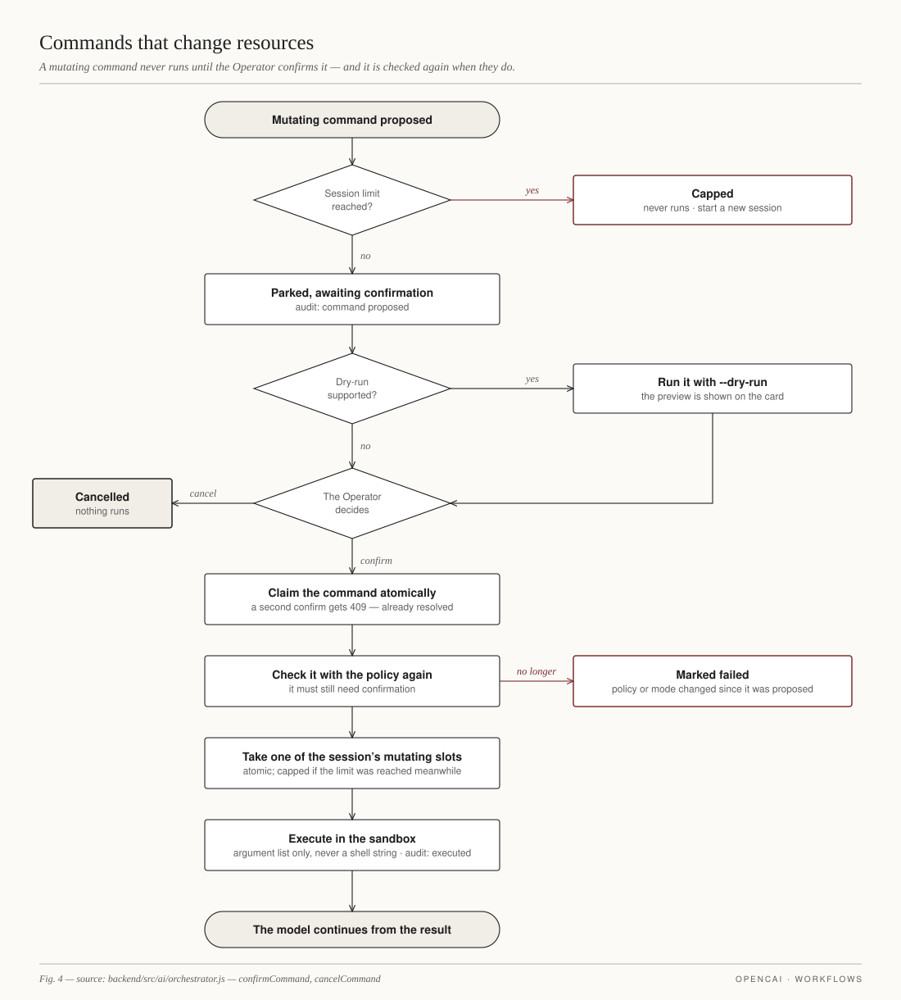
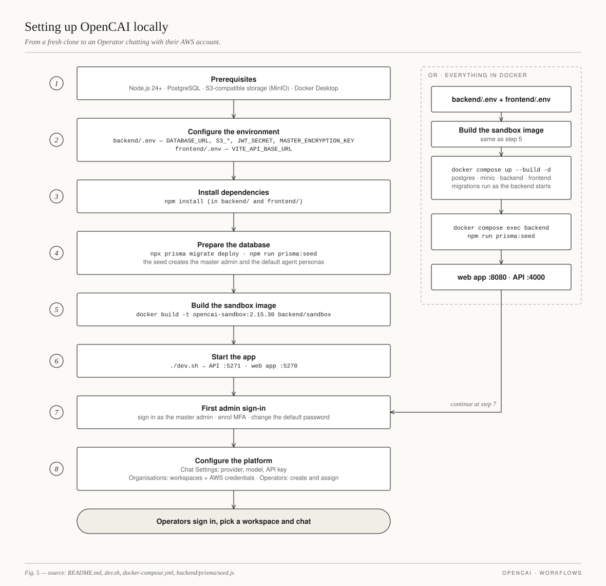
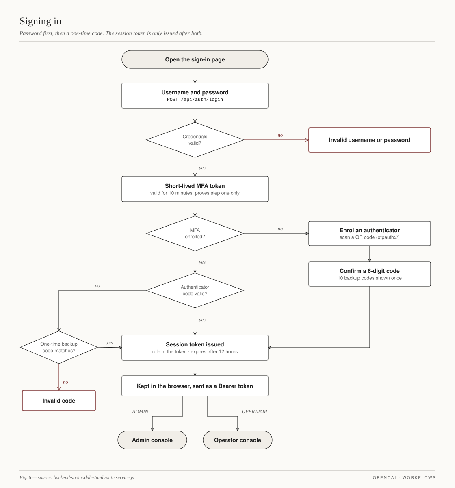
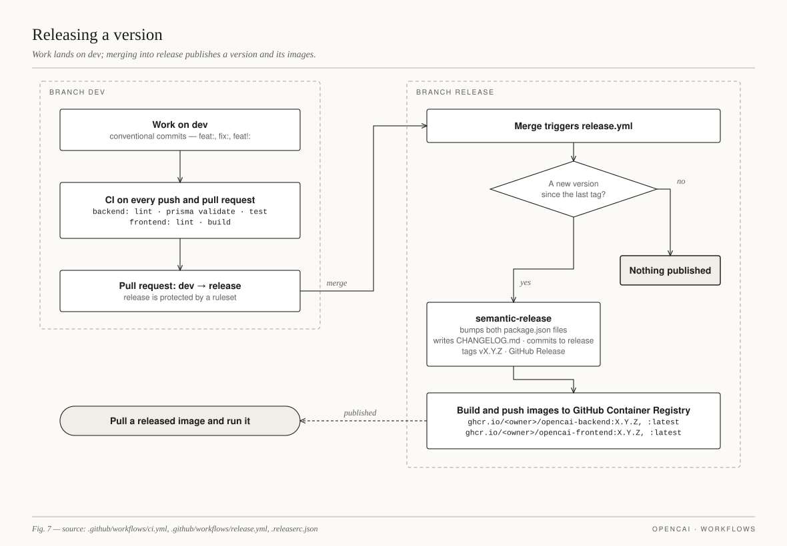

# Workflows

Diagrams of how OpenCAI works, drawn from the code they describe. Each figure
names its source files in its footer.

| Figure | What it shows |
|---|---|
| [1. System overview](01-system-overview.svg) | The parts of the system and what talks to what |
| [2. The life of a chat request](02-chat-request.svg) | From pressing Send to the answer on screen, including the agent loop and its limits |
| [3. How a proposed command is decided](03-command-decision.svg) | The command policy's checks, in order, and where each command ends up |
| [4. Commands that change resources](04-confirmation.svg) | The confirmation flow for mutating commands |
| [5. Setting up OpenCAI locally](05-local-setup.svg) | From a fresh clone to an Operator chatting, with or without Docker for everything |
| [6. Signing in](06-sign-in-and-mfa.svg) | Password, MFA enrolment and verification, backup codes |
| [7. Releasing a version](07-release.svg) | CI, the `dev` → `release` flow, semantic-release and image publishing |















## Updating the diagrams

The SVGs are generated by [`src/build.mjs`](src/build.mjs), which lays each
figure out with explicit coordinates. After editing it, rebuild from the repo
root:

```sh
node docs/workflows/src/build.mjs
```

Each diagram also has a PNG copy (2× resolution) for places that don't display
SVG. To refresh one, take a headless Chrome screenshot of the SVG at its own
width and height, for example:

```sh
chrome --headless=new --hide-scrollbars --force-device-scale-factor=2 \
  --window-size=1280,680 --screenshot=docs/workflows/01-system-overview.png \
  file:///ABSOLUTE/PATH/TO/docs/workflows/01-system-overview.svg
```

When the code a figure describes changes, update the figure in the same change.
